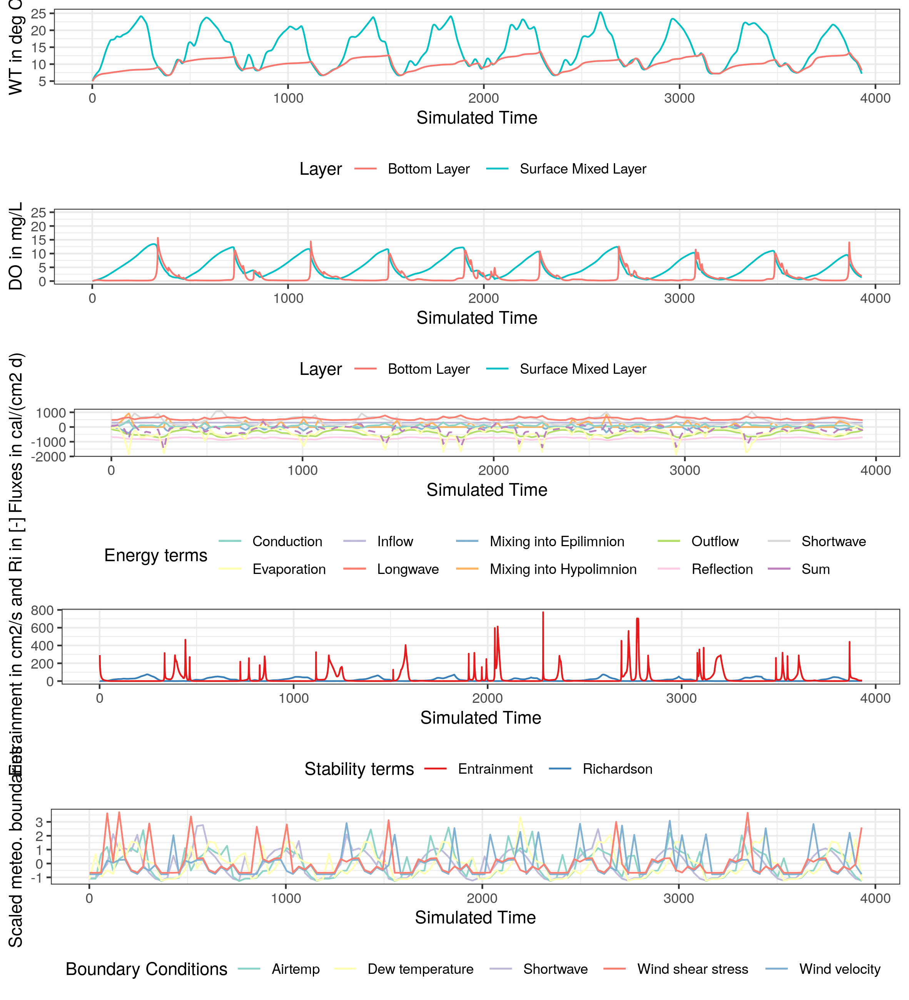

# thermod

thermod is a simple two-layer water temperature model that assumes that the lake is divided into two volumes: the epilimnion and the hypolimnion. Both layers are divided by a thermocline zone. The entrainment over the thermocline depends on a diffusion coefficient which is a function of the diffusion at neutral stability to the Richardson number.

All equations and derivations are from Steven C. Chapra (2008) 'Surface Water-Quality Modeling' Waveland Press, Inc.

You can run a toy model using the example.R script.

The package includes example setups for Lough Feeagh (IR) and Lake Mendota (USA).

<!-- -->
