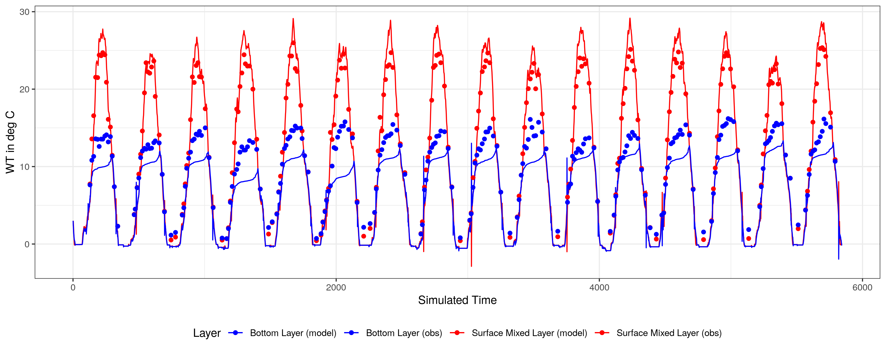

# thermod
<a href="https://github.com/robertladwig/thermod"></a>

thermod is a simple two-layer water temperature model that assumes that the lake is divided into two volumes: the epilimnion and the hypolimnion. Both layers are divided by a thermocline zone. The entrainment over the thermocline depends on a diffusion coefficient which is a function of the diffusion at neutral stability to the Richardson number. All equations and derivations are from Steven C. Chapra (2008) 'Surface Water-Quality Modeling' Waveland Press, Inc.

The 'forecasting version' is citeable via [](https://doi.org/10.5281/zenodo.4921686).

thermod allows you to
- simulate water temepratures in the epilimnion and hypolimnion as a function of meteorological forcing data
- simulate if the lake is stratified or mixed based on modeled water temperatures
- (experimental) simulate dissolved oxygen concentration in the epilimnion and hypolimnion

You can install the package in R using these commands:
```
require(devtools)
devtools::install_github("robertladwig/thermod")
```

You can run a toy model using the example.R script in `/inst/scripts`. The package also includes example setups for Lough Feeagh (IR) and Lake Mendota (USA).

If you already have a [LakeEnsemblR configuration](https://github.com/aemon-j/LakeEnsemblR) of your lake (you can also find [examples here](https://github.com/aemon-j/LER_examples)), you can easily run the model with these files natively in R:
```
library(thermod)

### GETTING CONFIGURATION INPUT FROM LER YAML FILE
config_file <- 'LakeEnsemblR.yaml'
folder = '.'
parameters <- configure_from_ler(config_file <- config_file, folder = folder)

# load in the boundary data
bound <- read_delim(paste0(folder,'/meteo.txt'), delim = '\t')

colnames(bound) <- c('Day','Jsw','Tair','Dew','vW')

# function to calculate wind shear stress (and transforming wind speed from km/h to m/s)
bound$Uw <- 19.0 + 0.95 * (bound$vW * 1000/3600)^2
bound$vW <- bound$vW * 1000/3600

boundary <- bound

# simulation maximum length
times <- seq(from = 1, to = max(boundary$Day), by = 1)

# initial water temperatures
yini <- c(3,3)

# run the model
out <- run_model(bc = boundary, params = parameters, ini = yini, times = times)

# visualize the results
result <- data.frame('Time' = out[,1],
                     'WT_epi' = out[,2], 'WT_hyp' = out[,3])
ggplot(result) +
  geom_line(aes(x=Time, y=WT_epi, col='Surface Mixed Layer')) +
  geom_line(aes(x=(Time), y=WT_hyp, col='Bottom Layer')) +
  labs(x = 'Simulated Time', y = 'WT in deg C')  +
  theme_bw()+
  guides(col=guide_legend(title="Layer")) +
  theme(legend.position="bottom")
```
<!-- -->

A comparison between modeled epilimnion (red solid line) and hypolimnion (blue solid line) water temperatures to observed temepratures at 1 (red dots) and 20 m (blue dots) depth, respectively, for Lake Mendota shows that thermod is capable of sufficently replicating real lake dynamics:

<!-- -->

The model can also simulate oxygen dynamics using simplified assumptions (atmospheric exchange, constant NEP, constant sediment oxygen demand, and entrainment over the thermocline):
<!-- -->

All Lake Mendota data is from the NTL LTER long-term monitoring program:

N. Lead PI, J. Magnuson, S. Carpenter, and E. Stanley. 2019. North Temperate Lakes LTER: Physical Limnology of Primary Study Lakes 1981 - current ver 27. Environmental Data Initiative. https://doi.org/10.6073/pasta/c120b223f80c63982457a2e1e76f6038 (Accessed 2021-02-26).

N. Lead PI, J. Magnuson, S. Carpenter, and E. Stanley. 2020. North Temperate Lakes LTER: Chemical Limnology of Primary Study Lakes: Nutrients, pH and Carbon 1981 - current ver 52. Environmental Data Initiative. https://doi.org/10.6073/pasta/8359d27bbd91028f222d923a7936077d (Accessed 2021-02-26).
